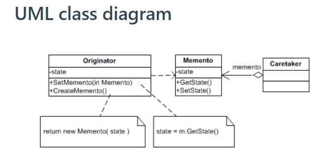
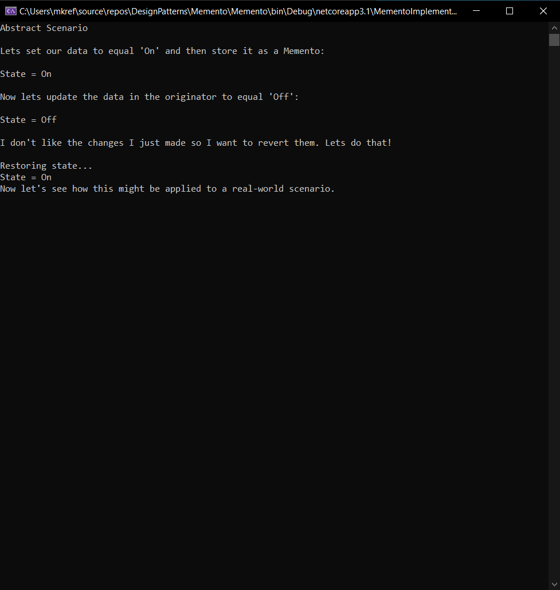
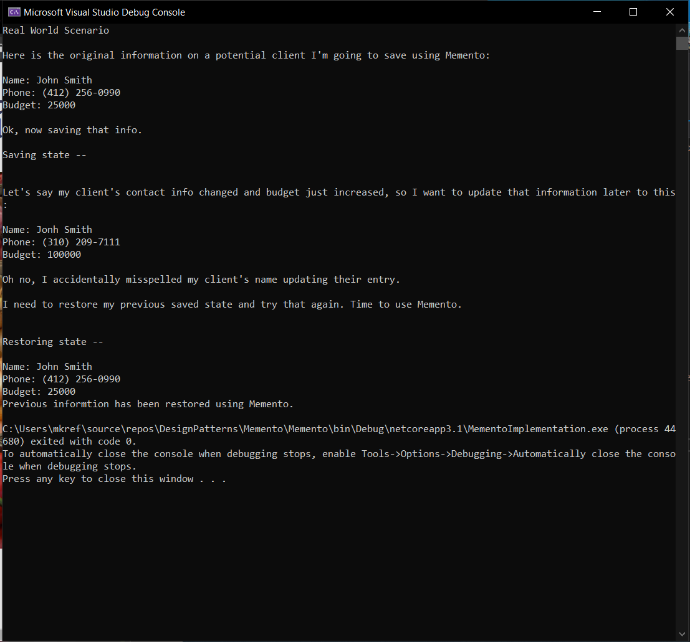

# Memento

## Description: The Memento Design Pattern
The Memento design pattern seeks to capture and externalize an object's state so that the object can be restored to this state at a later time.
The purpose of this pattern is to separate the current state of the object from a previous state, so that if something happens to the current state the object's state can be restored from it's Memento.

## Key Participants
The classes and objects participating in this pattern:
- Memento: stores the internal state of the Originator object.
- Originator:  creates a memento containing a snapshot of its current internal state.
- Caretaker: responsible for the memento's safekeeping but never operates on or examines the contents of the memento.

## UML Class Diagram

## Application Images

- Abstract Scenario

## Credit
The code implementation contained within this file was based on an example found on Do Factory: https://www.dofactory.com/net/memento-design-pattern
Aspects of the slide deck came from the following sources:
- Do Factory .NET Design Patterns Tutorials: https://www.dofactory.com/net/memento-design-pattern
- Eric & Elisabeth Freeman, Your Brain on Design Patterns: Head First Design Patterns: http://ce.sharif.edu/courses/98-99/2/ce484-1/resources/root/Design%20Patterns/Eric%20Freeman,%20Elisabeth%20Freeman,%20Kathy%20Sierra,%20Bert%20Bates-Head%20First%20Design%20Patterns%20-OReilly%20(2008).pdf
- Matthew Jones, Exception Not Found, "The Memento Design Pattern in C#: https://www.exceptionnotfound.net/memento-pattern-in-csharp/

## Link to the slides
https://docs.google.com/presentation/d/15Y8WkF4bxmVWKNL1b-lBYxivYZHmlhZ05ex742zNqe8/edit?usp=sharing